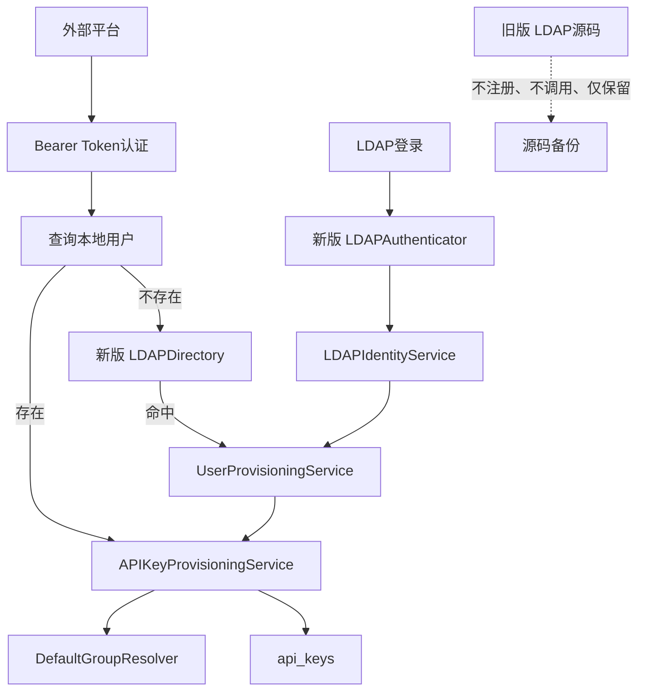

# 默认分组与外部 API Key 自动供应实施 Plan

> 状态：**Final — user approved（用户已批准）**

## 1. 文档信息

| 项目 | 内容 |
|---|---|
| 标题 | 默认分组、用户初始化与外部 API Key 自动供应实施 Plan |
| 状态 | Final — user approved（用户已批准） |
| 版本 | v1.0 |
| 日期 | 2026-07-07 |
| 变更摘要 | 明确旧版 LDAP 代码仅保留源码、不参与运行；新版 LDAP 拆分逻辑独立实现 |

## 2. 背景与目标

系统未来主要运营一个默认分组，并持续维护该分组的模型路由。同时，所有新用户应自动获得 API Key；外部模型平台可以通过受保护接口，为本地或 LDAP 用户幂等获取平台专属 API Key。

目标：

- `G-01`：管理员可以配置默认分组名。
- `G-02`：提供独立页面维护默认分组的模型路由。
- `G-03`：所有入口创建的新用户自动获得默认 API Key。
- `G-04`：默认分组存在时自动绑定，不存在时创建未绑定 Key。
- `G-05`：提供受访问凭证保护的外部平台 API Key供应接口。
- `G-06`：本地用户不存在时查询 LDAP，并按需创建本地账户。
- `G-07`：同一用户与平台最多存在一个有效平台 Key。
- `G-08`：新版 LDAP逻辑独立拆分，同时不删除旧版 LDAP源码。

非目标：

- 不迁移已有用户的 API Key。
- 不自动删除或禁用其他分组。
- 不允许外部接口修改 Key额度、状态或分组。
- 不在运行时保留新旧 LDAP切换、回退或双轨机制。
- 不继续使用旧版 LDAP用户创建逻辑。
- 本期不实现 OAuth2 Client Credentials。

## 3. 设计决策

### 3.1 用户创建范围

以下入口全部执行默认初始化：

- 邮箱注册；
- OAuth/SSO 首次登录；
- LDAP首次登录；
- 管理员创建用户；
- 外部接口触发的 LDAP用户落库。

### 3.2 LDAP源码保留原则

旧版 LDAP代码只作为源码备份保留，不参与新版系统运行。

具体要求：

- 不删除旧版 LDAP源码；
- 不让旧版逻辑参与依赖注入、路由注册或业务调用；
- 不提供运行时切换开关；
- 不提供自动回退旧版的机制；
- 新版代码不得调用旧版 LDAP用户创建流程；
- 新版 LDAP查询、认证和用户落库逻辑写在独立文件和组件中；
- 旧版代码可加 `Deprecated` 或 `Legacy backup` 注释，明确禁止新增调用；
- 若旧代码继续参与 Go包编译，必须保持可编译，但不要求运行；
- 旧版测试可保留作为历史行为记录，但不得阻止新版明确改变 LDAP架构；
- 后续是否删除旧版代码属于独立清理任务，本 Plan不处理。

推荐结构：

```text
internal/pkg/ldapauth/
├── legacy_client.go          # 原旧版代码，仅源码保留
├── legacy_types.go           # 旧版类型，仅备份需要时保留
├── directory.go              # 新版 LDAP只读目录查询
├── authenticator.go          # 新版 LDAP密码认证
├── client.go                 # 新版连接、TLS、Bind公共能力
└── types.go                  # 新版身份模型
```

业务层：

```text
internal/service/
├── legacy_ldap_user_flow.go  # 原旧版流程，仅保留源码
├── ldap_identity_service.go  # 新版 LDAP身份处理
└── user_provisioning_service.go
```

如将旧代码移动会制造较大 Git噪声，也可以保持旧文件原位置，只需：

- 新版逻辑使用全新类型与文件；
- 移除旧版运行调用；
- 添加明确的 Legacy注释；
- 禁止新代码引用旧版入口。

### 3.3 用户查找顺序

外部接口：

1. 使用 `username` 精确查询本地用户；
2. 本地不存在时查询 LDAP；
3. LDAP存在时创建本地账户；
4. LDAP不存在时返回 `USER_NOT_FOUND`；
5. LDAP故障时返回 `LDAP_UNAVAILABLE`。

### 3.4 新版 LDAP拆分

新版 LDAP能力拆成：

- `LDAPClient`：连接、TLS、超时和Bind；
- `LDAPDirectory`：通过服务账户按用户名查询目录；
- `LDAPAuthenticator`：验证用户密码，供正常 LDAP登录使用；
- `LDAPIdentityService`：把 LDAP身份映射为本地身份；
- `UserProvisioningService`：创建用户并执行统一初始化。

外部接口只调用：

```text
LDAPDirectory.LookupUser
UserProvisioningService.Provision
```

不调用 LDAP登录流程，也不签发用户 JWT。

### 3.5 无密码 LDAP查询

`LookupUser(username)` 使用受限 LDAP服务账户执行 Search Bind。

要求：

- 使用 TLS或 StartTLS；
- 使用现有属性映射；
- 转义 LDAP筛选值；
- 限制返回数量；
- 恰好一个结果才算命中；
- 没有服务查询账户时返回 `LDAP_UNAVAILABLE`；
- 不使用目标用户密码。

### 3.6 外部凭证

采用：

```http
Authorization: Bearer <provisioning-access-token>
```

依据：[RFC 6750](https://datatracker.ietf.org/doc/html/rfc6750)、[RFC 9110](https://datatracker.ietf.org/doc/html/rfc9110)、[OWASP REST Security Cheat Sheet](https://cheatsheetseries.owasp.org/cheatsheets/REST_Security_Cheat_Sheet.html)。

配置：

```yaml
external_api_key_provisioning:
  enabled: false
  access_token: ""
```

支持环境变量：

```text
EXTERNAL_API_KEY_PROVISIONING_ENABLED
EXTERNAL_API_KEY_PROVISIONING_ACCESS_TOKEN
```

要求：

- 生产环境通过 Secret Manager或环境变量注入；
- 不通过管理员接口回显；
- 不记录值、前缀或长度；
- 使用恒定时间比较；
- 仅允许 HTTPS；
- 未启用时接口返回 `404`。

### 3.7 默认分组

- 设置键：`default_group_name`。
- 保存时去除首尾空格且不能为空。
- 通过名称精确匹配分组。
- 修改名称只影响之后创建的 Key。
- 默认分组不存在时不自动创建。
- 默认分组缺失不阻塞用户或 Key创建，`group_id = NULL`。

### 3.8 平台规则

平台名必须满足：

```regex
^[a-z_]+$
```

最大长度为 50。

唯一业务键：

```text
(user_id, platform)
```

Key命名：

```text
普通默认 Key：Default API Key
平台 Key：<platform> API Key
```

## 4. 功能设计

### `FR-01` 配置默认分组名

管理员可在系统设置中配置默认分组名。

响应包含：

```json
{
  "default_group_name": "default",
  "default_group_exists": true,
  "default_group_id": 12
}
```

同名分组不存在时仍允许保存。

### `FR-02` 默认模型路由页面

新增管理员页面“默认模型路由”。

默认分组存在时编辑：

- `model_routing_enabled`
- `model_routing`

从现有 `GroupsView.vue` 抽取共享逻辑：

```text
GroupModelRoutingEditor
normalizeRoutingRules
validateRoutingRules
convertRoutingRulesToApiFormat
```

避免复制两套模型路由表单。

### `FR-03` 创建缺失的默认分组

默认分组不存在时显示：

- 当前默认分组名；
- “默认分组不存在”；
- “创建默认分组”按钮。

创建卡片复用现有逻辑，名称锁定为默认分组名。创建成功后刷新并进入路由编辑状态。

### `FR-04` 统一新用户初始化

新增 `UserProvisioningService`，负责：

- 创建用户；
- 生成随机本地密码并保存哈希；
- 设置注册来源；
- 初始化余额、并发数及 RPM；
- 分配默认订阅；
- 初始化平台额度和模型额度；
- 创建普通默认 API Key；
- 绑定默认分组。

默认 Key创建属于核心初始化，失败时用户创建事务回滚。

旧版 LDAP创建代码不复用、不调用，只保留源码。

### `FR-05` 新版 LDAP登录接入

现有 LDAP登录入口改为调用：

```text
LDAPAuthenticator.Authenticate
LDAPIdentityService
UserProvisioningService
```

旧版实现仍保留在源码中，但不再被 Handler、Service或依赖注入引用。

### `FR-06` 外部平台 Key供应

```http
POST /api/v1/integrations/api-keys/ensure
Authorization: Bearer <token>
Content-Type: application/json
```

请求：

```json
{
  "username": "zhangsan",
  "platform": "cursor"
}
```

响应：

```json
{
  "api_key": "sk-...",
  "platform": "cursor",
  "status": "active",
  "created": true
}
```

已有 Key时返回同一个 Key，`created = false`。

### `FR-07` LDAP用户按需落库

本地用户不存在时：

1. 调用新版 `LDAPDirectory.LookupUser`；
2. 未命中返回 `USER_NOT_FOUND`；
3. 命中后调用 `UserProvisioningService`；
4. 不生成用户 JWT；
5. 完成所有新用户初始化；
6. 创建平台专属 Key。

因此新创建的 LDAP用户通常获得：

- 一个普通默认 Key；
- 一个平台专属 Key。

### `FR-08` 平台 Key唯一性

数据库保证未软删除记录的：

```text
(user_id, platform)
```

对非空平台唯一。

并发唯一冲突时重新查询并返回已有 Key。

### `FR-09` 已有平台 Key状态

- `active`：直接返回。
- `disabled`、`expired`、`quota_exhausted`：返回已有 Key及状态。
- 不自动恢复、重置或创建第二个 Key。
- 已软删除记录可重新创建。

## 5. 技术设计

### 5.1 组件职责

| 组件 | 职责 |
|---|---|
| `SettingService` | 默认分组名配置 |
| `DefaultGroupResolver` | 根据配置解析默认分组 |
| `LDAPClient` | 新版连接与Bind基础设施 |
| `LDAPDirectory` | 新版无密码目录查询 |
| `LDAPAuthenticator` | 新版 LDAP密码认证 |
| `LDAPIdentityService` | LDAP身份映射 |
| `UserProvisioningService` | 统一用户创建与初始化 |
| `APIKeyProvisioningService` | 幂等创建平台 Key |
| `ExternalProvisioningAuthMiddleware` | 验证 Bearer Token |
| `GroupModelRoutingEditor` | 共享模型路由编辑逻辑 |
| 旧版 LDAP源码 | 仅保留，不参与运行 |

### 5.2 数据流



### 5.3 `api_keys` 数据模型

新增：

| 字段 | 类型 | Null | 默认值 | 含义 |
|---|---|---:|---|---|
| `platform` | varchar(50) | 是 | `NULL` | 外部平台名 |
| `purpose` | varchar(20) | 否 | `user_created` | Key用途 |

`purpose`：

- `default`
- `platform`
- `user_created`

约束：

- 未软删除的非空 `(user_id, platform)` 唯一；
- 每个未软删除用户最多一个 `purpose = default`；
- PostgreSQL使用条件唯一索引；
- MySQL使用生成列或项目现有等效方案。

### 5.4 接口契约

默认分组：

```http
GET /api/v1/admin/default-group
PUT /api/v1/admin/settings/default-group
```

外部 Key供应：

```http
POST /api/v1/integrations/api-keys/ensure
```

| HTTP | Code | 场景 |
|---:|---|---|
| 200 | — | 已有平台 Key |
| 201 | — | 新建平台 Key |
| 400 | `INVALID_USERNAME` | 用户名非法 |
| 400 | `INVALID_PLATFORM` | 平台名非法 |
| 401 | `INVALID_ACCESS_TOKEN` | Token缺失或错误 |
| 404 | `USER_NOT_FOUND` | 本地与 LDAP均不存在 |
| 404 | `NOT_FOUND` | 功能未启用 |
| 409 | `USER_IDENTITY_CONFLICT` | LDAP身份冲突 |
| 423 | `USER_NOT_ACTIVE` | 用户已停用 |
| 429 | `RATE_LIMITED` | 请求过多 |
| 503 | `LDAP_UNAVAILABLE` | LDAP不可用 |
| 503 | `SERVICE_UNAVAILABLE` | 数据库或初始化失败 |

响应头：

```http
Cache-Control: no-store
Pragma: no-cache
```

### 5.5 事务

用户供应事务：

1. 用户记录；
2. 必需初始化数据；
3. 普通默认 Key；
4. 默认分组绑定。

平台 Key事务：

1. 复核用户状态；
2. 解析默认分组；
3. 创建平台 Key。

并发唯一冲突不直接报错，而是回读已有记录。

## 6. 核心伪代码

### 默认分组解析

```text
function resolveDefaultGroup():
    name = trim(settings.get("default_group_name"))
    if name is empty:
        return NONE_CONFIGURED

    group = groups.findByExactName(name)
    if group not found:
        return CONFIGURED_BUT_MISSING

    return FOUND(group)
```

### 新版 LDAP查询

```text
function lookupLDAPUser(username):
    require LDAP enabled
    require service bind credentials

    connect using TLS or StartTLS
    bind service account
    escaped = ldapEscapeFilter(username)
    results = search(configuredFilter, escaped, limit=2)

    if zero results:
        return USER_NOT_FOUND
    if result count != 1:
        return USER_IDENTITY_CONFLICT

    return normalizedIdentity
```

### 用户供应

```text
function provisionNewUser(identity, source):
    begin transaction

    existing = findCanonicalUser(identity)
    if existing:
        rollback
        return existing, created=false

    passwordHash = hash(secureRandomPassword())
    defaults = resolveSignupDefaults(source)
    user = createUser(identity, passwordHash, defaults)

    applyRequiredInitialization(user, defaults)

    groupID = resolveDefaultGroup().id or null
    createAPIKey(
        userID=user.id,
        name="Default API Key",
        platform=null,
        purpose="default",
        groupID=groupID
    )

    commit
    runNonCriticalPostCommitInitialization(user)
    return user, created=true
```

### 外部平台 Key供应

```text
function ensurePlatformKey(request):
    validateBearerTokenConstantTime(request.authorization)
    rateLimit(request.sourceIP)

    username = validateUsername(request.username)
    platform = validate(request.platform, "^[a-z_]+$")

    user = findLocalUser(username)

    if user not found:
        ldapIdentity = newLDAPDirectory.lookupUser(username)
        if ldapIdentity not found:
            return USER_NOT_FOUND
        user = provisionNewUser(ldapIdentity, "ldap")

    if user not active:
        return USER_NOT_ACTIVE

    existing = findByUserAndPlatform(user.id, platform)
    if existing:
        return existing, created=false

    try:
        groupID = resolveDefaultGroup().id or null
        key = createPlatformKey(user.id, platform, groupID)
        return key, created=true
    catch unique conflict:
        return findByUserAndPlatform(user.id, platform), created=false
```

## 7. 安全与可观测性

- 强制 HTTPS。
- Token只允许通过 Bearer Header传递。
- Token至少 256 bit随机值。
- 限制请求体大小。
- 禁用不必要的 CORS。
- LDAP筛选输入必须转义。
- 对认证失败和业务调用分别限流。
- Token、LDAP密码和完整 API Key不得写入日志。
- 审计记录请求 ID、用户 ID、平台、来源 IP及创建结果。

指标：

```text
external_apikey_provision_requests_total{result}
external_apikey_created_total{platform}
ldap_lookup_total{result}
ldap_authentication_total{result}
user_provision_total{source,result}
default_group_resolution_total{result}
default_key_creation_total{result}
```

旧版 LDAP代码不产生运行指标，因为它不参与运行。

## 8. 验证策略

### 8.1 LDAP测试

- 新版密码认证测试。
- 新版无密码 Lookup测试。
- LDAP未命中、重复命中、连接失败和Bind失败测试。
- LDAP筛选器注入测试。
- 新版 LDAP登录能够调用统一用户供应服务。
- 静态检查确保运行代码不引用旧版 LDAP入口。
- 旧版源码仍存在且仓库能够正常构建。
- 不测试运行时新旧切换，因为系统不存在该机制。

### 8.2 用户初始化测试

覆盖：

- 邮箱注册；
- OAuth首次登录；
- LDAP首次登录；
- 管理员创建；
- 外部接口触发 LDAP落库。

验证：

- 创建一个用户；
- 创建一个普通默认 Key；
- 默认分组存在时正确绑定；
- 默认分组不存在时 `group_id = NULL`。

### 8.3 并发测试

并发调用时：

- 只创建一个本地用户；
- 只创建一个普通默认 Key；
- 只创建一个平台 Key；
- 所有成功响应返回同一个平台 Key。

### 8.4 安全测试

- Query或Body中的 Token不能认证。
- Token和 API Key不进入日志。
- 非 JSON及超大请求被拒绝。
- 响应禁止缓存。
- 无效 Token触发限流。

### 8.5 验收标准

| ID | 验收标准 |
|---|---|
| `AC-01` | 管理员可配置默认分组名 |
| `AC-02` | 独立页面可编辑默认分组模型路由 |
| `AC-03` | 默认分组不存在时可通过名称锁定卡片创建 |
| `AC-04` | 所有新用户入口均创建默认 Key |
| `AC-05` | 默认分组不存在不阻塞用户创建 |
| `AC-06` | LDAP存在的用户可由外部接口自动落库 |
| `AC-07` | LDAP不存在时返回 `USER_NOT_FOUND` |
| `AC-08` | 同一用户和平台只产生一个平台 Key |
| `AC-09` | 平台名严格满足 `^[a-z_]+$` |
| `AC-10` | 外部 Token仅通过 Bearer Header接收 |
| `AC-11` | 旧版 LDAP源码未被删除 |
| `AC-12` | 旧版 LDAP逻辑不参与运行 |
| `AC-13` | 新版 LDAP逻辑位于独立组件和文件 |
| `AC-14` | 修改默认分组名不迁移已有 Key |

## 9. 实施顺序

### 阶段一：数据与配置

- 增加 `platform`、`purpose` 和唯一约束。
- 增加默认分组设置。
- 增加外部供应安全配置。
- 实现 `DefaultGroupResolver`。

### 阶段二：统一用户供应

- 新增 `UserProvisioningService`。
- 接入所有用户创建入口。
- 默认 Key纳入核心事务。

### 阶段三：独立实现新版 LDAP

- 保留旧版 LDAP源码。
- 新增 `LDAPClient`、`LDAPDirectory`、`LDAPAuthenticator`。
- 新增 `LDAPIdentityService`。
- 将运行入口接入新版组件。
- 确认依赖注入和业务代码不再引用旧版入口。
- 不增加新旧切换或回退配置。

### 阶段四：外部平台 Key接口

- 实现 Bearer认证。
- 实现 LDAP查询和用户按需落库。
- 实现平台 Key幂等创建。
- 增加限流、审计和脱敏。

### 阶段五：默认模型路由页面

- 抽取共享模型路由编辑器。
- 新增页面与导航。
- 复用默认分组创建卡片。

### 阶段六：验证与发布

- 执行前后端、迁移、LDAP及安全测试。
- 静态确认旧版 LDAP未被运行代码引用。
- 配置默认分组、LDAP服务账户和访问 Token。
- 验证后启用外部供应接口。

## 10. 风险与回滚

| 风险 | 缓解 |
|---|---|
| 旧版源码被误调用 | Legacy注释、独立命名及静态引用检查 |
| 新版 LDAP行为与原系统不同 | 完整认证、查询与用户创建回归测试 |
| LDAP没有服务查询账户 | 作为启用外部供应的前置条件 |
| 用户初始化入口分散 | 收敛至统一供应服务 |
| 平台 Key并发重复 | 数据库唯一约束与冲突回读 |
| 默认分组不存在 | 创建未绑定 Key并告警 |
| 外部 Token泄露 | Secret Manager、Bearer、限流和轮换 |

回滚时：

- 关闭外部供应功能；
- 回滚新版业务调用代码；
- 旧版源码的存在仅辅助人工恢复，不构成运行时自动回退；
- 保留新增数据库字段，避免平台信息丢失；
- 前端页面可独立回滚。

## 11. 追踪矩阵

| 目标 | 功能 | 组件 | 验收 |
|---|---|---|---|
| `G-01` | `FR-01` | `SettingService` | `AC-01` |
| `G-02` | `FR-02`、`FR-03` | 路由页面、共享编辑器 | `AC-02`、`AC-03` |
| `G-03` | `FR-04` | `UserProvisioningService` | `AC-04` |
| `G-04` | `FR-04` | `DefaultGroupResolver` | `AC-05` |
| `G-05` | `FR-06`～`FR-09` | 外部供应服务 | `AC-08`～`AC-10` |
| `G-06` | `FR-07` | `LDAPDirectory` | `AC-06`、`AC-07` |
| `G-07` | `FR-08` | 数据库唯一约束 | `AC-08` |
| `G-08` | `FR-05` | 新版 LDAP组件、旧源码保留 | `AC-11`～`AC-13` |

## 12. 评审记录

| 版本 | 状态 | 内容 |
|---|---|---|
| v0.1 | 已修订 | 初始草案 |
| v0.2 | 已修订 | 曾误解为运行时保留旧版 LDAP回退 |
| v0.3 | 已批准 | 明确旧版 LDAP仅保留源码，不参与系统运行；新版逻辑独立实现 |
| v1.0 | Final — user approved | 用户批准并固化为最终实施 Plan |
